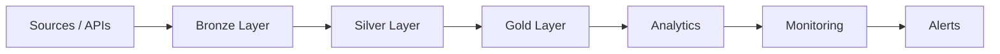

# Database Reliability Engineering
### Principal Database Engineer | Cloud Data Architect | SRE

Production-grade platform for building **self-healing, high-scale, and resilient database systems**


---

## Key Highlights

- VLDB systems (>100TB)
- 99.99% uptime architectures
- Autonomous failover systems
- Zero-downtime migrations
- Performance governance (CI/CD enforced)
- 30–70% performance improvements
- 30–50% cost optimization

---

## Why This Repository Stands Out

Most repositories show pipelines.

This repository demonstrates **system-level engineering**:

- Preventing failures (DDL Guardrails)
- Detecting failures (Observability + Monitoring)
- Recovering automatically (Failover Systems)
- Enforcing performance (CI/CD Governance)
- Migrating at scale (100TB+ workloads)

This is a **production blueprint**, not a tutorial.

---

## Architecture Overview



---

## Autonomous Failover Architecture


---

## System Layers

| Layer | Capability |
|------|-----------|
| Data Platform | ETL, Medallion Architecture |
| Database Engineering | Query tuning, partitioning |
| Reliability | Failover, monitoring |
| Governance | Performance budgets, DDL guardrails |
| Migration | 100TB+ enterprise workflows |

---

## Quick Start

```bash
git clone https://github.com/nitish120789/database-reliability-engineering.git
cd database-reliability-engineering
docker-compose up
```

---

## Repository Navigation (Start Here)

Use this map to quickly find the right content by objective:

- Day-2 DBA/DBRE operations:
	- `database_admin/`
- Data platform and ETL engineering:
	- `data-platform/`, `data_engineering/`, `pipelines/`
- HA/DR and failover automation:
	- `ha-failover/`, `cloud-migration/`, `infrastructure/`
- Architecture and reference guides:
	- `docs/`
- Performance and guardrails:
	- `db-optimization/`, `db-guardrails/`

Canonical governance documents:

- Gap analysis and roadmap:
	- `docs/repository-gaps-and-improvement-plan.md`
- Taxonomy and naming conventions:
	- `docs/repository-taxonomy.md`
- Standard runbook template:
	- `database_admin/templates/runbook_template.md`

---

## Runbooks and Reliability Standards

**Operational runbooks are the primary resource for incident response and operational procedures.** Each follows a standardized format (Summary, Impact, Preparation, Procedure, Verification, Rollback, Communication, Evidence).

### Critical Path Runbooks (Sev-1 Incidents)

- [Incident Response - PostgreSQL](database_admin/sre/runbooks/incident_response.md) - stabilize service degradation; <10 min target
- [Lock/Deadlock Triage & Resolution](database_admin/sre/runbooks/lock-deadlock-triage-and-resolution.md) - resolve blocking/deadlock; <5 min target
- [Failover Procedure](database_admin/sre/runbooks/failover_procedure.md) - promote replica; <15 min target
- [Disaster Recovery](database_admin/sre/runbooks/disaster_recovery.md) - major failure recovery; <60 min target (Tier-1)

### Operational Procedures

- [Change Management & Release](database_admin/sre/runbooks/change-management-and-release.md) - safe schema/config changes with risk gates
- [Backup Verification & Restore Drill](database_admin/sre/runbooks/backup-verification-and-restore-drill.md) - prove RTO/RPO; monthly cadence
- [Symptom-Driven Troubleshooting Decision Tree](database_admin/sre/runbooks/symptom-driven-troubleshooting-decision-tree.md) - diagnostic triage by symptom

**Complete runbook index**: [database_admin/sre/runbooks/README.md](database_admin/sre/runbooks/README.md)

### Operating Standards (Cross-Platform)

- [Security & Compliance Operating Standard](database_admin/standards/security-and-compliance-operating-standard.md) - mandatory controls, access, encryption, audit, patch SLAs
- [Capacity & FinOps Operating Standard](database_admin/standards/capacity-and-finops-operating-standard.md) - forecasting, optimization, cost governance
- [Alerting & Monitoring Configuration](database_admin/standards/alerting-and-monitoring-configuration.md) - alert hierarchy, SLO thresholds, operationalization

Minimum reliability controls expected:

- SLO/RTO/RPO context and targets
- Safety gates and approval requirements
- Preconditions and risk gates
- Verification criteria and success conditions
- Rollback or fallback path
- Evidence collection for audit and postmortems
- Automation opportunities identified

## Learning and Interview Path

Suggested progression for structured learning and interview preparation:

1. Foundation:
	 - `database_admin/estate_operations/00_governance/`
	 - `database_admin/estate_operations/02_observability/`
2. Reliability operations:
	 - `database_admin/sre/runbooks/`
	 - `database_admin/backup/`
	 - `database_admin/replication/`
3. Performance and scaling:
	 - `db-optimization/`
	 - `database_admin/indexing/`
	 - `database_admin/performance/`
4. Architecture and migration design:
	 - `docs/architecture/`
	 - `cloud-migration/`
	 - `migrations/`

---

## Core Capabilities

### Data Engineering
- Medallion architecture (dbt + dlt)
- End-to-end pipelines

### Database Engineering
- Partitioning strategies
- Query optimization
- HA/DR replication

### Platform Engineering
- Terraform modules
- Kubernetes deployment
- Docker sandbox

### Observability
- Pipeline freshness
- Schema drift
- Data contracts

---

## Performance Governance (CI/CD Gate)

- Every pull request triggers benchmark execution
- Query performance compared against baseline
- >10% regression automatically fails pipeline

### Outcome

- Prevents performance degradation
- Enforces database SLAs
- Aligns engineering with cost efficiency

---

## Autonomous Failover System (Azure SQL)

- Health checks monitor availability
- Heartbeat detects repeated failures
- Event-driven architecture triggers recovery
- Dispatcher routes execution

### Outcome

- Zero manual intervention
- Faster recovery response
- Reduced operational risk

---

## DDL Guardrails (Safe Schema Changes)

- Pre-check policies validate system load
- Guardrails prevent risky schema changes
- Shadow migrations for large tables
- Threshold-based monitoring

### Outcome

- Eliminates lock-related outages
- Enables safe schema evolution
- Engineered deployment safety

---

## Key Projects

- Retail ETL Pipeline → Batch + streaming ingestion with validation
- Oracle → PostgreSQL Migration → 100TB+ with ora2pg + CDC
- SQL Server → Azure SQL → Data Box + Parquet + ADF
- Autonomous Failover System → Event-driven recovery pipeline

---

## Real-World Use Cases

- Financial transaction systems (low latency + HA)
- Retail analytics pipelines (batch + streaming)
- IoT ingestion systems (high throughput)
- Enterprise cloud migrations (100TB+ data)

---

## Benchmark Snapshot

| Format | Query Time | Storage |
|--------|------------|--------|
| Parquet | 1.2s | 1.0x |
| Avro | 2.0s | 1.3x |
| Delta | 1.3s | 1.1x |

---

## Why Engineers Star This Repo

- Production-grade architecture patterns
- Covers Data + DBA + SRE together
- Includes failure scenarios and solutions
- Shows automation, not just scripts
- Designed for scale, not demos

---

## CI/CD

GitHub Actions enabled

---

## Contributing

Pull requests are welcome
