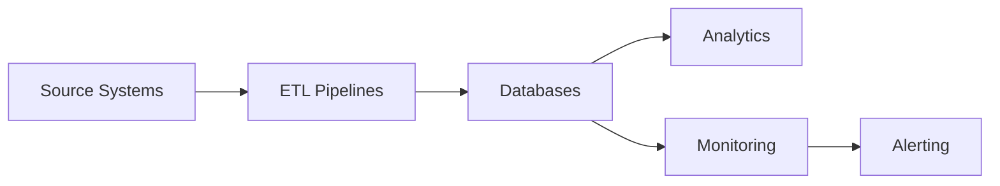
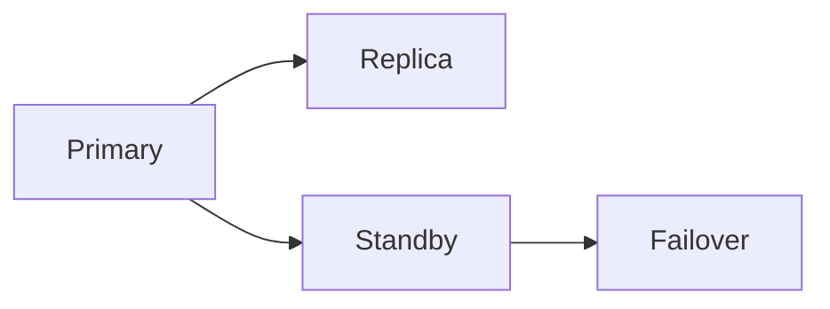

# Principal Database Engineer | Cloud Data Architect | SRE


## Tech Stack
Oracle | SQL Server | PostgreSQL | MySQL | Sybase ASE | Azure SQL | ClickHouse | Redis | Aerospike | Cosmos DB | AWS RDS/Aurora | Kubernetes | Terraform | Ansible | Python

---

## Highlights
- VLDB systems (>100TB)
- 99.99% uptime architectures
- HA/DR multi-region deployments
- Zero-downtime migrations
- Automation-first engineering
- Cost optimization (30-50% savings)

---

## Architecture



### HA/DR


---

## Projects
- Retail ETL pipeline
- Oracle RAC + Data Guard HA/DR
- SQL Server Always On + Log Shipping
- PostgreSQL/MySQL migrations (AWS DMS, ora2pg)
- ClickHouse analytics pipeline
- Redis/Aerospike caching demo
- Cosmos DB global distribution

---

## How to Run

```bash
git clone https://github.com/nitish120789/Data-Engineering.git
cd Data-Engineering
python projects/retail_etl/ingest.py
python projects/retail_etl/transform.py
python projects/retail_etl/load.py
```

---

## Real-world Use Cases
- Retail ETL
- IoT ingestion
- Financial pipelines
- Cloud-native lakehouse

---

## Why this repo matters

Demonstrates production-grade engineering across databases, cloud, and SRE practices.

---

## CI/CD
GitHub Actions enabled for pipeline validation.
