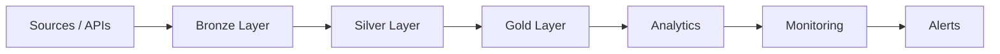

# Data Platform Architecture Blueprint
### Principal Database Engineering | Data Platform | SRE

Production-grade Unified Data Platform combining Data Engineering, Advanced DBA, and Reliability Engineering.


---

## Why This Repository Exists

This repository demonstrates how to design, operate, and scale production data systems that do not fail under load.

- VLDB systems (>100 TB)
- 99.99% uptime architectures
- Multi-region HA/DR
- Zero-downtime migrations
- Automation-first engineering
- 30–70% performance improvements
- 30–50% cost optimization

---

## Architecture Overview



---

## Core Architectural Philosophy

1. Idempotent pipelines
2. Observability (freshness, drift, anomalies)
3. Schema governance via contracts
4. Performance engineering (partitioning, indexing)

---

## Medallion Architecture

| Layer | Purpose |
|------|--------|
| Bronze | Raw ingestion |
| Silver | Cleaned + validated |
| Gold | Business-ready |

---

## Core Capabilities

### Data Engineering
- Medallion architecture (dbt + dlt)
- End-to-end pipelines

### Database Engineering
- Partitioning strategies
- Query optimization
- HA/DR replication

### Platform Engineering
- Terraform modules
- Kubernetes deployment
- Docker sandbox

### Observability
- Pipeline freshness
- Schema drift
- Data contracts

---

## Performance Governance (CI/CD Gate)

This platform enforces automated performance budgets:

- Every pull request triggers benchmark execution
- Query performance is compared against baseline metrics
- If regression exceeds 10%, the pipeline fails automatically

### Outcome

- Prevents performance degradation in production
- Enforces database SLAs
- Aligns engineering with cost efficiency

---

## Benchmark Snapshot

| Format | Query Time | Storage |
|--------|------------|--------|
| Parquet | 1.2s | 1.0x |
| Avro | 2.0s | 1.3x |
| Delta | 1.3s | 1.1x |

---

## Local Sandbox

```bash
cd data-platform/docker
docker-compose up
```

---

## Projects

- Retail ETL pipeline
- Oracle to PostgreSQL migration
- HA/DR deployments
- Storage benchmarking

---

## Why Engineers Star This Repo

- Production-grade architecture
- Covers Data + DBA + SRE
- Real-world patterns

---

## CI/CD

GitHub Actions enabled

---

## Contributing

Pull requests are welcome
